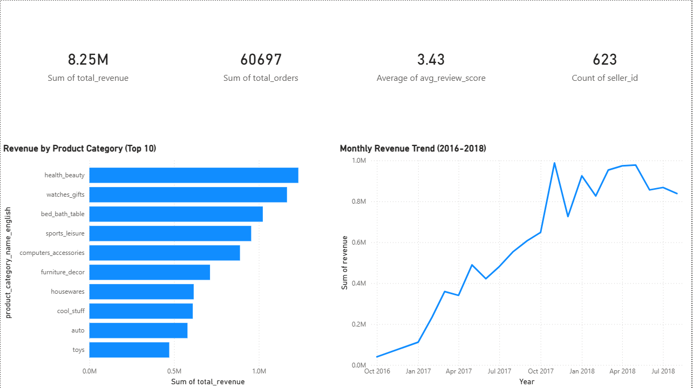
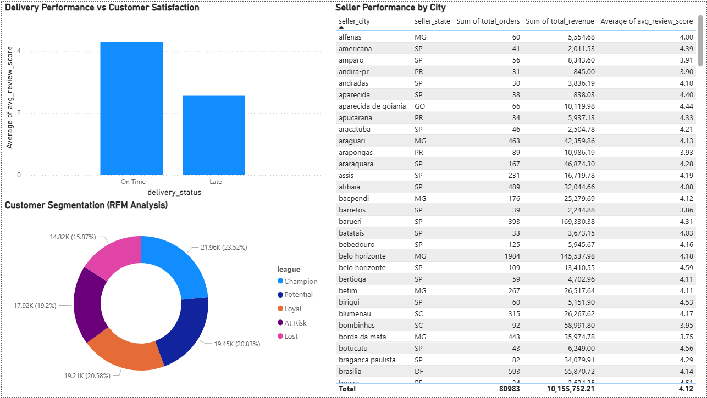

# Olist E-Commerce — Growth & Retention Analysis

## Overview
End-to-end analytics project analyzing 100,000+ real orders
from Olist, Brazil's largest e-commerce marketplace.

Built to answer one business question:
> "Where is Olist losing money and customers,
>  and what should they do about it?"

Unlike a standard EDA project, every finding in this analysis
is tied to a specific business action.

---

## The Numbers That Matter

| Finding | Number | Business Impact |
|---|---|---|
| Late delivery satisfaction drop | 67% lower score (2.57 vs 4.29) | Biggest operational risk |
| Champion customers vs revenue | 24% of customers = 50% revenue | Biggest retention risk |
| At Risk + Lost customers | 32,742 customers going cold | Recoverable revenue opportunity |
| Problem sellers | 4 out of 632 scoring below 3.0 | Immediate reputation risk |
| Platform growth rate | 22.8% avg month-over-month | Validates further investment |
| Top category revenue | R$1.23M — Health & Beauty | Priority for marketing spend |

---

## Dashboard Preview



---

## Business Problems Solved

### Problem 1 — Revenue by Category
Which product categories deserve the most investment?

**Finding:** Health & Beauty leads at R$1.23M but Watches & Gifts
has the highest value per order at R$199 . two categories that
need completely different growth strategies.

### Problem 2 — Revenue Growth Trend
Is the business growing sustainably or just spiking?

**Finding:** 22.8% average month-over-month growth driven by
new customer acquisition - not price increases. A healthy signal
that validates further platform investment.

### Problem 3 — Delivery vs Customer Satisfaction
How much does a late delivery actually cost the business?

**Finding:** Late deliveries score 2.57/5 vs 4.29/5 for on-time —
a 67% gap. 7,700 orders (8%) were late, each representing a
customer unlikely to return. On-time orders arrive 13 days early
on average . Olist's conservative estimates are working.

### Problem 4 — RFM Customer Segmentation
Who are the most valuable customers and who is about to leave?

**Finding:** 21,959 Champion customers generate R$6.9M — nearly
half of total platform revenue. 32,742 At Risk and Lost customers
represent recoverable revenue through targeted win-back campaigns.
97% of customers are one-time buyers , retention is the
platform's biggest long-term challenge.

### Problem 5 — Seller Performance
Which sellers are assets and which are liabilities?

**Finding:** 68% of sellers score above 4.0. But 4 sellers score
below 3.0 despite delivering on time , their issue is product
quality, not logistics. Average delivery is 11.7 days early —
the SLA system is working well.

---

## Key Recommendations

1. **Investigate the 4 problem sellers immediately** —
   poor reviews despite on-time delivery signals product
   quality issues that standard SLAs cannot fix

2. **Protect Champion customers** — 24% generating 50%
   of revenue need a loyalty programme before they churn

3. **Win back At Risk customers** — 17,924 customers going
   cold are cheaper to retain than acquiring new ones

4. **Reduce late deliveries** — 7,700 late orders scoring
   67% lower is the single highest-impact operational fix

---

## Project Structure
```
olist-growth-and-retention-analysis/
│
├── notebooks/
│   └── eda.ipynb              # Complete analysis notebook
│
├── dashboard/
│   └── olist_dashboard.pbix   # Power BI dashboard
│
├── screenshots/
│   ├── dashboard_page1.png    # Revenue Analysis page
│   └── dashboard_page2.png    # Customer & Seller page
│
├── ingestion_db.py            # PostgreSQL data ingestion script
├── requirements.txt           # Python dependencies
└── README.md
```


## Dataset
- **Source:** Kaggle — Brazilian E-Commerce Public Dataset by Olist
- **Period:** September 2016 — August 2018
- **Scale:** 100,000+ orders across 9 relational tables

---

## Conclusion
Late deliveries, undervalued Champion customers and 4 low-scoring
sellers are the three biggest threats to Olist's platform growth.
Health & Beauty leads revenue while 24% of customers generate
nearly 50% of total revenue ,making customer retention the
single highest business priority. The data does not just describe
the problem ,it points to exactly where Olist should act first.
